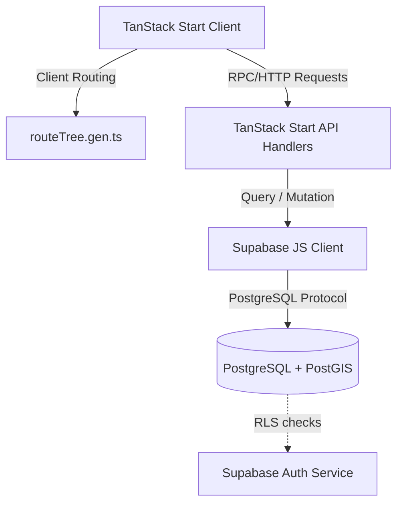

# HomeHunt System Architecture

This document describes the high-level architecture, request flows, authentication, and authorization structures of the HomeHunt platform.

## Overview

HomeHunt is built as a unified full-stack TypeScript application utilizing **TanStack Start** (leveraging Vite and Nitro under the hood) combined with **Supabase** for database, storage, and authentication.

## Frontend Architecture

- **Framework:** TanStack Start (React + TypeScript).
- **Routing:** File-based routing under `src/routes/`. Main application shell is defined in `src/routes/__root.tsx`.
- **State Management:** TanStack Query (`@tanstack/react-query`) is utilized for server state caching, queries, and mutations.
- **Visual System:** Tailwind CSS v4, utilizing a customized design system (Manrope/Bricolage Grotesque fonts, deep acacia green, warm terracotta accents, and a warm paper background).

## Backend Architecture

- **Server Engine:** Nitro (embedded in TanStack Start).
- **API Routing:** Declared via server route handlers in TypeScript (e.g. `src/routes/api/v1/health.ts`).
- **Configuration:** Structured server config managed via typings in `src/core/config/server-config.ts`.
- **Telemetry:** Structured JSON logging (`src/core/observability/logger.ts`) with request correlation IDs tracked in headers (`src/core/observability/request-id.ts`).

## Database Architecture

- **Engine:** PostgreSQL hosted on Supabase.
- **Extensions:** PostGIS (for distance calculations and spatial query search).
- **Schema Management:** Supabase SQL migration scripts.

## Request Flow

1. The **User** interacts with the Client UI (built with Radix UI / shadcn).
2. Client sends HTTP requests, injecting a `X-Request-ID` correlation ID.
3. The **Start API Handler** intercepts the request, maps the request context, and resolves user identity from the request authorization token.
4. Database requests are executed via the **Supabase Client**, utilizing Row Level Security (RLS) policies to enforce privacy.
5. JSON API responses are returned to the client, carrying the correlation ID in headers for debug logging.

## Authentication & Authorization

- **Authentication:** Managed by Supabase Auth (JWT bearer tokens).
- **Authorization (RBAC):** Extends authentication via the database table `public.user_roles` with roles mapping to an ENUM (`tenant`, `landlord`, `agent`, `property_manager`, `verifier`, `admin`, `super_admin`).
- **Resource Ownership:** Enforced directly via PostgreSQL RLS policies checking resource actor IDs (e.g. `auth.uid() = actor_id`).
