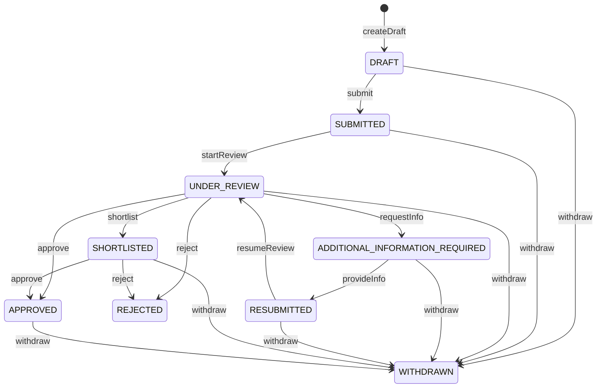

# Application State Machine

This document details the lifecycle states and transition rules enforced server-side for all rental applications on HomeHunt.

## Lifecycle States

An application progresses through the following states:

- **`DRAFT`**: Initial state. Applicant is editing parameters and uploading checklist documents. Hidden from providers.
- **`SUBMITTED`**: Seeker has finalized the application. Provider is notified.
- **`UNDER_REVIEW`**: Provider team has accessed the application and initialized review workspace.
- **`ADDITIONAL_INFORMATION_REQUIRED`**: Landlord has requested missing references or replacement files.
- **`RESUBMITTED`**: Seeker has answered the information request and uploaded files. Landlord is notified.
- **`SHORTLISTED`**: Candidate has passed preliminary checks and is shortlisted.
- **`APPROVED`**: Final positive decision. Entry point to Phase 8 Tenancy/Lease creation.
- **`REJECTED`**: Final negative decision. Rejection category logged.
- **`WITHDRAWN`**: Seeker has cancelled the application.
- **`EXPIRED`**: The listing has closed or listing duration has elapsed.

## State Transition Rules

The server validates every status change against the following transition matrix. Unregistered transitions are blocked:

## Validation Logic

- **Client Requests**: Any action modifying status checks authorization (applicant vs provider vs admin) and executes `validateStatusTransition(current, next)`.
- **Eligibility Checking**: Submit action verifies that the listing is currently `PUBLISHED`, the unit is `AVAILABLE`, the applicant does not already have an active application, and viewing requirements are fully satisfied.
