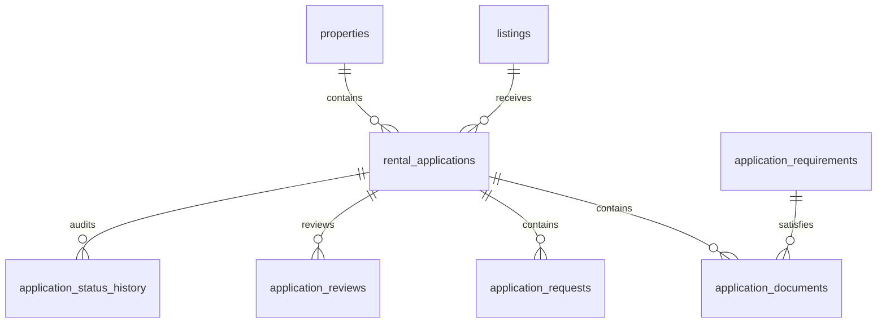

# Rental Applications Architecture

This document details the database schemas, API server functions, and system integrations for the rental applications module on HomeHunt.

## Entity-Relationship Mapping

The database schema is defined as a set of relational tables mapping application workflows to listing requirements:

- **`application_requirements`**: Defines listing-specific checklist items.
- **`rental_applications`**: The core application document storing snapshotted values (e.g. rent, deposit) and personal/employment JSON parameters.
- **`application_documents`**: Stores decrypted private storage links corresponding to requirements.
- **`application_requests`**: Stores missing or rejected evidence follow-up requests.
- **`application_reviews`**: Stores internal team scoring and notes logs.
- **`application_status_history`**: Holds the audit trail events of state changes.

## API Server Functions

All write and read operations are implemented as type-safe server-side actions (`createServerFn`) under `src/features/applications/applications.functions.ts`:

- `createApplicationDraft`: Initializes a new DRAFT application for a listing.
- `updateApplicationDraft`: Persists updated personal, household, and income parameters.
- `submitApplication`: Validates viewing records, mandatory checklist uploads, and marks application as SUBMITTED.
- `withdrawApplication`: Withdraws an application, removing it from landlord review workspace.
- `providerReviewApplication`: Starts review work (moves status to `UNDER_REVIEW`) and inserts internal notes.
- `providerRequestInformation`: Creates an information request and moves status to `ADDITIONAL_INFORMATION_REQUIRED`.
- `respondToInformationRequest`: Uploads files, resolves the request, and transitions status to `RESUBMITTED`.
- `providerRecordDecision`: Sets final status to `APPROVED` or `REJECTED`.

## Integrations

- **Phase 4 (Trust & Verification)**: Seeker verification status is displayed in the review panel. Application files are uploaded to private storage bucket `application_documents` and accessed via short-lived (15 min) signed URLs.
- **Phase 5 (Intelligent Matching)**: Matching scores help guide discovery, but recommendation weights do not influence state changes.
- **Phase 6 (Communication & Viewings)**: Physical viewing records with status `COMPLETED` are validated server-side on submission if required. System status notifications are dispatched using `NotificationService`. Direct messaging is integrated via contextual conversation threads.
