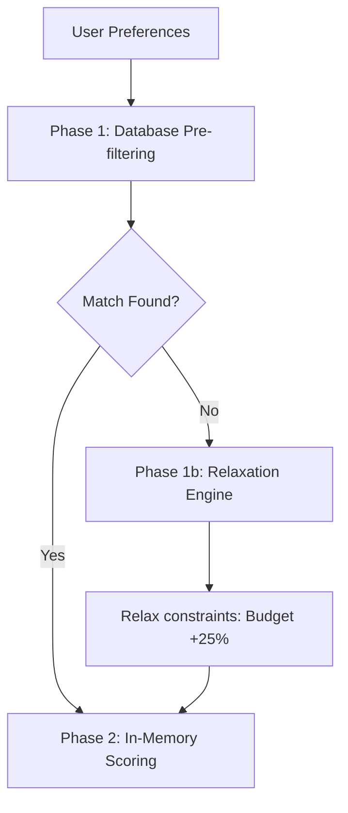

# Housing Matching Engine — Query Architecture

This document describes the candidate generation, filtering pipelines, and database query optimizations implemented in the matching engine.

---

## 1. Candidate Generation
To prevent expensive calculations across all listings, candidate generation uses a two-phase query pipeline:

### Pre-filtering rules:
* Excludes listings that have been hidden (`recommendation_feedback` type `HIDE`).
* Limits results strictly to published and active listings.
* Evaluates basic dimensions (price <= 1.25x max budget, property types in preference array, bedrooms matching rules).

---

## 2. Database Indexes
The following indexes optimize lookup speeds:
* `idx_user_prefs_user_id` on `user_preferences(user_id)`
* `idx_rec_feedback_user_id` on `recommendation_feedback(user_id)`
* `idx_rec_history_user_id` on `recommendation_history(user_id)`
