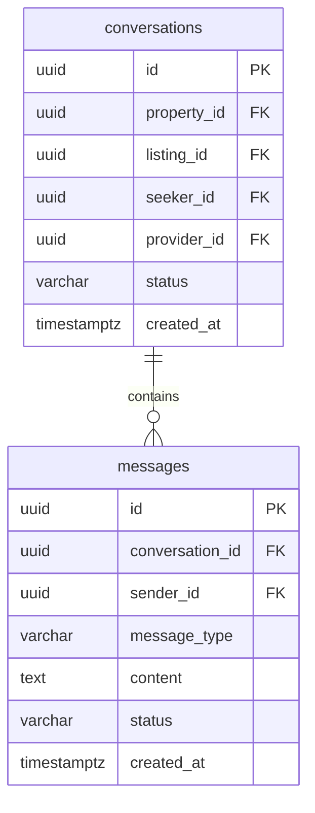

# Architecture Documentation - Messaging

The HomeHunt messaging system is built on TanStack Start server functions and a Postgres relational database schema.

## Database Schema

## Security

1. **Row Level Security (RLS)**:
   - Access to conversations and messages is restricted at the DB layer using RLS rules checking `auth.uid() = seeker_id OR auth.uid() = provider_id`.
   
2. **Server-Side Authorization**:
   - Every function validates caller token context before querying data or executing database operations.
