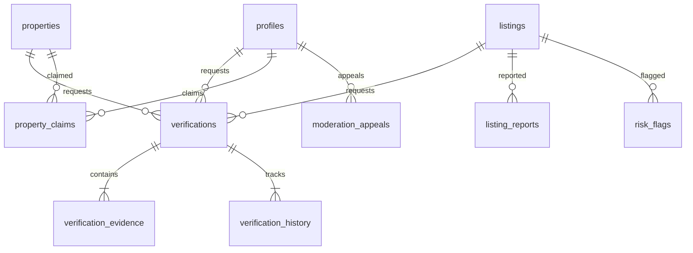

# Verification & Trust Layer — Technical Architecture

This document describes the technical architecture, database schemas, storage access rules, permissions models, and state machines implemented in Phase 4 of the HomeHunt platform.

---

## 1. Database Schema Design

The trust infrastructure consists of the following Postgres entities:

### Enums & Types

- `verification_status`: `UNVERIFIED`, `PENDING`, `UNDER_REVIEW`, `VERIFIED`, `REJECTED`, `EXPIRED`, `REVOKED`
- `verification_type`: `IDENTITY`, `PROPERTY_OWNERSHIP`, `PROPERTY_EXISTENCE`, `LISTING`, `CONTACT`, `AGENT`, `LANDLORD`
- `evidence_status`: `PENDING`, `APPROVED`, `REJECTED`
- `listing_freshness_status`: `CURRENT`, `STALE`, `REQUIRES_REVALIDATION`, `EXPIRED`
- `report_reason`: `WRONG_PRICE`, `PROPERTY_UNAVAILABLE`, `FAKE_LISTING`, `WRONG_LOCATION`, `MISLEADING_PHOTOS`, `DUPLICATE_LISTING`, `SUSPICIOUS_PAYMENT_REQUEST`, `IMPERSONATION`, `OTHER`
- `report_status`: `OPEN`, `UNDER_REVIEW`, `RESOLVED`, `DISMISSED`, `ESCALATED`
- `risk_severity`: `LOW`, `MEDIUM`, `HIGH`, `CRITICAL`
- `risk_status`: `OPEN`, `RESOLVED`, `DISMISSED`
- `claim_status`: `PENDING`, `APPROVED`, `REJECTED`, `WITHDRAWN`
- `appeal_status`: `APPEAL_SUBMITTED`, `UNDER_REVIEW`, `UPHELD`, `REVERSED`

---

## 2. Evidence File Storage & RLS Security

Sensitive documents (e.g. Identity Documents, Title Deeds, Utility Bills) are stored in a private Supabase Storage bucket `verification_evidence`.

### RLS Storage Policies:

1. **User Folder Isolation**: Users can only upload and write files inside folders named after their own `auth.uid()`.
   `bucket_id = 'verification_evidence' AND split_part(name, '/', 1) = auth.uid()::text`
2. **Reviewer Read Access**: Authorized verifiers, administrators, and super-administrators can read evidence files across all folders to perform inspections.
3. **Signed URLs**: The app frontend must never retrieve or expose direct files. Secure access is granted only via short-lived signed URLs (15 minutes expiry) signed on the server-side via `getSecureEvidenceUrl` after validation.

---

## 3. Server Actions & State Machines

All trust operations are implemented as TanStack Start server functions executing on the server runtime, wrapping permission assertions, transactions, and audit logging.

- **submitVerificationRequest**: Validates Zod inputs, asserts no active pending request exists of the same type, saves evidence links, writes initial PENDING history, and records audit trails.
- **reviewVerificationRequest**: Requires `VERIFICATION_REVIEW` or `VERIFICATION_APPROVE` role permissions. Applies approvals or rejections, updating core `profiles`/`properties`/`listings` flags.
- **submitPropertyClaim**: Prevents duplicate claims, flags automatic risk signals on multiple claims conflicts, and logs PENDING claims.
- **reportListing**: Implements rate limits (max 5 reports per hour per user). Automatically triggers a `RISK_FLAG` of type `REPEATED_REPORTS` and severity `MEDIUM` for moderator inspection on 3 or more open reports.
- **confirmListingFreshness**: Restores listing freshness to `CURRENT`, updating revalidation timestamps. Validates that caller is listing manager or property owner.

---

## 4. Audit Trail Actions

The trust system maps custom events to the platform's audit logging framework:

- `VERIFICATION_SUBMITTED`
- `VERIFICATION_APPROVED`
- `VERIFICATION_REJECTED`
- `VERIFICATION_REVOKED`
- `PROPERTY_CLAIMED`
- `CLAIM_APPROVED`
- `CLAIM_REJECTED`
- `REPORT_SUBMITTED`
- `REPORT_RESOLVED`
- `LISTING_REVALIDATED`
- `APPEAL_SUBMITTED`
- `APPEAL_RESOLVED`
- `RISK_FLAG_RESOLVED`
