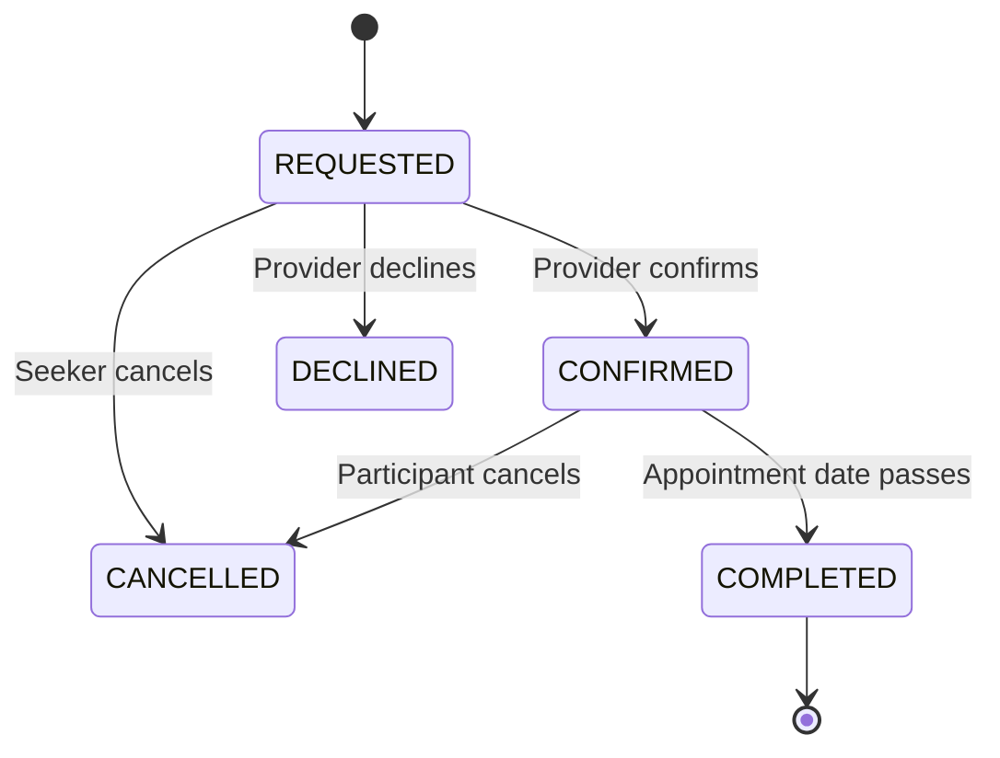

# Architecture Documentation - Viewing Management

Coordinate inspection schedules and manage conflicts.

## State Machine

## Concurrency Safety & Double-Booking

To prevent conflicting viewing appointments:

1. **Server-Side Verification**: Check if the requested start/end range overlaps with an existing confirmed appointment for the same listing/unit.
2. **Transaction Integrity**: The conflict check and confirmation update are performed within an atomic transaction layer.
