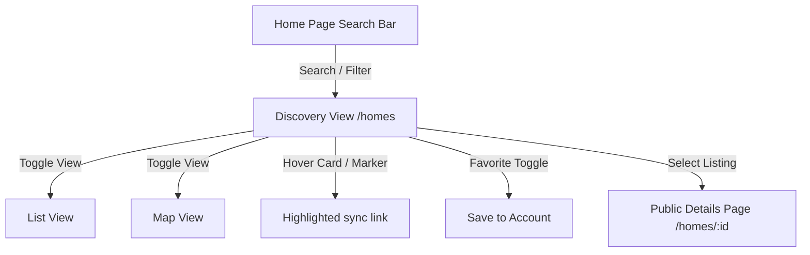

# HomeHunt Discovery & Search Product Specification

HomeHunt's search and discovery module connects home seekers with verified properties in Kenya.

## Tenant Experience

### Discovery Core Flows

1. **Structured Search Inputs**
   - Seekers filter listings by county, town, budget ranges (numeric min/max), property types, bed/bath counts, availability, and specific shared amenities (like Security, Backup Power, Borehole, Internet, CCTV, etc.).

2. **Dynamic Auto-suggestions**
   - As the user types in the location search bar, the autocomplete system suggests distinct matching neighborhoods, towns, or counties extracted dynamically from current active listings.

3. **List & Map Synchronisation**
   - On desktop, list cards and map price pins are side-by-side.
   - Hovering over a listing card centers and opens the details popup of its map marker.
   - Clicking a price marker opens the popup details and highlights the matching listing.

4. **URL State Preservation**
   - Every single filter action updates the URL query parameters. This allows bookmarking searches, sharing direct links, and retaining state when traversing back from a listing detail page.

5. **Bookmarks (Favorites)**
   - Authenticated seekers can click the heart icon on any card to save it. Unauthenticated users are redirected to login and returned to the search screen upon authentication.
